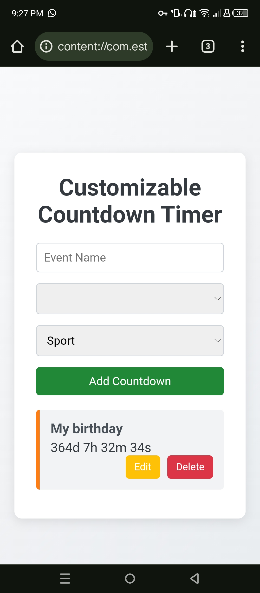

# Customizable Countdown Timer

A feature-rich and visually appealing countdown timer built with **HTML**, **CSS**, and **JavaScript**. This application allows users to create multiple personalized countdowns for various events such as birthdays, holidays, sports events, or any custom occasion. Users can customize themes, edit existing countdowns, and share their countdowns with others. All countdowns are saved in `localStorage` to ensure persistence across sessions.

## Project Link
[Customizable Countdown Timer GitHub Repository](https://github.com/yasinULLAH/Customizable-countdown-timer)

## Features
- **Add Multiple Countdowns**: Create as many countdowns as you need for different events.
- **Customizable Themes**: Choose from predefined themes like Sport, Holiday, Birthday, or create your own custom theme.
- **Edit & Delete Countdowns**: Modify event details or remove countdowns as needed.
- **Real-Time Countdown**: Displays days, hours, minutes, and seconds remaining until the event.
- **Responsive Design**: Optimized for both desktop and mobile devices.
- **Data Persistence**: All countdowns are saved in `localStorage` to retain data between sessions.
- **User-Friendly Interface**: Intuitive and clean UI for easy navigation and management of countdowns.

## Technologies Used
- **HTML**: Structuring the webpage.
- **CSS**: Styling and responsive design.
- **JavaScript**: Dynamic functionality and `localStorage` integration.

## Installation & Usage
To use the Customizable Countdown Timer locally:

1. **Clone the Repository:**
    ```bash
    git clone https://github.com/yasinULLAH/Customizable-countdown-timer.git
    ```
2. **Navigate to the Project Folder:**
    ```bash
    cd Customizable-countdown-timer
    ```
3. **Open `index.html` in Your Browser:**
    - You can simply double-click the `index.html` file, or
    - Use a local server for a better experience (optional).

## How to Use
1. **Add a Countdown:**
    - Enter the **Event Name** in the input field.
    - Select the **Event Date** using the date picker.
    - Choose a **Theme** from the dropdown menu (Sport, Holiday, Birthday, Custom).
    - Click the **"Add Countdown"** button to create the countdown.

2. **View Countdowns:**
    - All your countdowns will be listed below the form.
    - Each countdown displays the event name and the time remaining.

3. **Edit a Countdown:**
    - Click the **"Edit"** button next to the countdown you wish to modify.
    - Update the **Event Name**, **Event Date**, or **Theme** as desired.
    - Confirm the changes to update the countdown.

4. **Delete a Countdown:**
    - Click the **"Delete"** button next to the countdown you want to remove.
    - Confirm the deletion to remove the countdown from the list.

## Screenshots



## Contributing
Contributions are welcome! If you'd like to contribute to this project, please follow these steps:

1. **Fork the Repository.**
2. **Create a New Branch:**
    ```bash
    git checkout -b feature/YourFeatureName
    ```
3. **Commit Your Changes:**
    ```bash
    git commit -m 'Add some feature'
    ```
4. **Push to the Branch:**
    ```bash
    git push origin feature/YourFeatureName
    ```
5. **Open a Pull Request.**

## License
This project is open-source and available under the [MIT License](LICENSE).

## Contact
For any questions, issues, or suggestions, please open an issue on the [GitHub repository](https://github.com/yasinULLAH/Customizable-countdown-timer) or contact me directly at [your-email@example.com](mailto:your-email@example.com).

---

Happy Countdowning! 🎉
